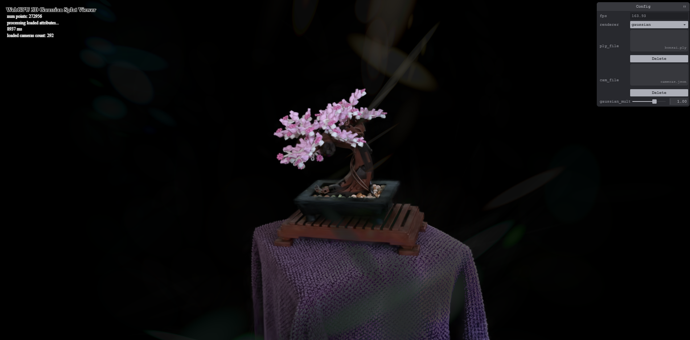

# Project5-WebGPU-Gaussian-Splat-Viewer

**University of Pennsylvania, CIS 565: GPU Programming and Architecture, Project 5**

* Daniel Chen
* Tested on: Chromium 144 - Windows 11, AMD Ryzen 7 8845HS w/ Radeon 780M Graphics (3.80 GHz), RTX 4070 notebook

This project is a WebGPU implementation of point cloud and Gaussian splat rendering.

Gaussian splat rendering is a rendering technique that depicts a set of oriented, scaled, colored points as small, volumetric Gaussian distribuions in 3D space. This model is is often used in photogrammetry, recreatng 3D scenes from photo data, by gradually making the set of points converge onto a progressively more accurate depiction of a scene. The resulting data can be stored in a `.ply` file, which, alongside a JSON file with camera data, can be read by this web app and rendered in real time as either a point cloud (only centers are drawn, which is faster) or as the full set of Gaussian splats.

### Live Demo

https://enamchae.github.io/Project5-WebGPU-Gaussian-Splat-Viewer/

### Demo Video/GIF

https://github.com/user-attachments/assets/e26cffa1-f91a-46f7-9415-3bf389344195

### Performance

### Credits

- [Vite](https://vitejs.dev/)
- [tweakpane](https://tweakpane.github.io/docs//v3/monitor-bindings/)
- [stats.js](https://github.com/mrdoob/stats.js)
- [wgpu-matrix](https://github.com/greggman/wgpu-matrix)
- Special Thanks to: Shrek Shao (Google WebGPU team) & [Differential Guassian Renderer](https://github.com/graphdeco-inria/diff-gaussian-rasterization)
